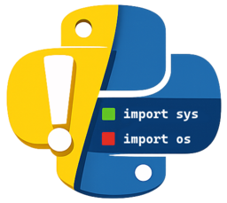

# Important

<p align="center">
  
</p>

A Visual Studio Code extension that validates and formats Python import statements according to the [Google Python Style Guide](https://google.github.io/styleguide/pyguide.html#313-imports-formatting). It provides real-time diagnostics as you type, highlights unused imports, and can automatically fix all issues including wildcard imports, incorrect ordering, and symbol imports. The extension scans your code to understand which imports are actually used and applies intelligent fixes that update both the import statements and all related symbol references throughout your file.

## Features

**Important** helps you maintain clean, consistent Python imports by:

- **Real-time validation** - Issues are highlighted as you type
- **Unused import detection** - Faded highlighting for imports not used in your code
- **Quick fixes** - One-click "Fix All" for import problems
- **Auto-fix all** - Fix all issues and sort imports with a single command
- **Smart sorting** - Groups imports correctly and removes unused ones
- **Google Style Guide compliance** - Enforces industry-standard import conventions

### Validation Rules

| Rule                       | Description                                                   | Auto-Fix |
| -------------------------- | ------------------------------------------------------------- | -------- |
| No relative imports        | `from .module import x` → `from package.module import x`      | ✅       |
| No wildcard imports        | `from os.path import *` → `import os` + `os.path.func()`      | ✅       |
| One import per line        | `import os, sys` → separate statements                        | ✅       |
| Import modules not symbols | `from pkg.mod import Cls` → `from pkg import mod` + `mod.Cls` | ✅       |
| Unused imports             | Imports not referenced in code are removed                    | ✅       |
| Duplicate imports          | Multiple identical imports are merged                         | ✅       |
| Correct ordering           | stdlib → third-party → local                                  | ✅       |
| Alphabetical order         | Within each group                                             | ✅       |

### Example

Before running "Fix Imports":

```python
import requests
import os, sys
from os.path import *
from models.user import User
import json

print(abspath("."))
user = User()
```

After:

```python
import json
import os
import sys

import requests

from models import user

print(os.path.abspath("."))
user = user.User()
```

### Commands

- **Important: Fix Imports in This File** - Apply all available fixes, remove unused imports, and sort
- **Important: Validate Imports in This File** - Run validation manually

Access via Command Palette (`Ctrl+Shift+P` / `Cmd+Shift+P`) or right-click context menu.

## Installation

### From VS Code Marketplace

1. Open VS Code
2. Go to Extensions (`Ctrl+Shift+X` / `Cmd+Shift+X`)
3. Search for "Important"
4. Click **Install**

### Manual Installation (VSIX)

1. Download or build the `.vsix` file (see [Building](#building))
2. Open VS Code
3. Go to Extensions (`Ctrl+Shift+X` / `Cmd+Shift+X`)
4. Click the `...` menu → **Install from VSIX...**
5. Select the `.vsix` file

Or via command line:

```bash
code --install-extension important-0.0.3.vsix
```

## Configuration

Configure via VS Code Settings (`Ctrl+,` / `Cmd+,`):

| Setting                    | Type    | Default    | Description                                              |
| -------------------------- | ------- | ---------- | -------------------------------------------------------- |
| `important.validateOnSave` | boolean | `true`     | Validate imports when saving                             |
| `important.validateOnType` | boolean | `true`     | Validate imports as you type and after formatter changes |
| `important.styleGuide`     | string  | `"google"` | Style guide to use                                       |

### Example settings.json

```json
{
	"important.validateOnSave": true,
	"important.validateOnType": true,
	"important.styleGuide": "google"
}
```

### Import Sorting

The "Fix Imports" command includes automatic import sorting that:

- Groups imports: stdlib → third-party → local
- Sorts alphabetically within each group
- Splits multi-imports (`import os, sys`) into separate lines
- Removes unused imports
- Merges duplicate imports
- Fixes wildcard imports by converting to qualified module access

### Wildcard Import Fixing

Wildcard imports (`from X import *`) are automatically fixed for supported stdlib modules:

- `os`, `os.path`, `sys`
- `re`, `json`, `collections`
- `typing`, `pathlib`, `datetime`
- `math`, `functools`, `itertools`

The fix converts the import and updates all symbol usages:

```python
# Before
from os.path import *
print(abspath("."))

# After
import os
print(os.path.abspath("."))
```

## Building

### Prerequisites

- [Node.js](https://nodejs.org/) 18+
- npm 9+

### Development Build

```bash
# Clone the repository
git clone https://github.com/irarainey/important.git
cd important

# Install dependencies
npm install

# Compile
npm run compile

# Run linter
npm run lint
```

### Watch Mode

For development with auto-recompilation:

```bash
npm run watch
```

### Package for Distribution

Create a `.vsix` file for manual installation:

```bash
npm run package
```

The package will be created in the `package/` directory.

## Project Structure

```
important/
├── src/
│   ├── extension.ts            # Extension entry point & lifecycle
│   ├── types.ts                # TypeScript type definitions
│   ├── providers/              # VS Code language providers
│   │   ├── code-action-provider.ts  # Quick fix code actions
│   │   └── hover-provider.ts        # Hover information for diagnostics
│   ├── validation/             # Import validation logic
│   │   ├── import-parser.ts    # Import statement parsing
│   │   ├── import-validator.ts # Validation rules
│   │   └── diagnostics.ts      # Diagnostic conversion
│   ├── fixes/                  # Import fixing logic
│   │   ├── fix-imports.ts      # Fix all imports command
│   │   └── sort-imports.ts     # Import sorting
│   └── utils/                  # Utility modules
│       ├── module-symbols.ts   # Known symbols for wildcard import fixing
│       ├── stdlib-modules.ts   # Python standard library module list
│       └── text-utils.ts       # Text/regex utilities
├── python-runtime/             # Python runtimes (for future isort integration)
│   └── README.md               # Runtime build instructions
├── examples/
│   └── sample_project/         # Sample Python project for testing
│       └── src/
│           ├── main.py             # Multiple issues: multi-imports, order, unused
│           ├── helpers/helpers.py  # Parent relative import, multiple imports
│           ├── models/models.py    # Clean file (no issues)
│           └── utils/utils.py      # Relative imports, symbol imports
├── scripts/
│   ├── download-python-standalone.sh  # Download Python runtimes
│   └── build-python-runtime.sh        # Build runtime from local Python
├── dist/                       # Compiled output (generated)
├── package.json                # Extension manifest & dependencies
├── tsconfig.json               # TypeScript configuration
└── eslint.config.mjs           # ESLint configuration
```

## Development

### Running in Debug Mode

1. Open the project in VS Code
2. Press `F5` to launch Extension Development Host
3. The sample project (`examples/sample_project`) opens automatically
4. Open any Python file to see import validation in action

The sample project includes intentional import violations for testing:

| File                     | Violations                                                     |
| ------------------------ | -------------------------------------------------------------- |
| `src/main.py`            | Multiple imports, wrong order, unused, wildcard, symbol import |
| `src/utils/utils.py`     | Symbol import, wrong alphabetical order                        |
| `src/helpers/helpers.py` | Multiple imports on one line, unused import                    |
| `src/models/models.py`   | ✅ Clean - no issues (for comparison)                          |

### Available Scripts

| Script                  | Description                                             |
| ----------------------- | ------------------------------------------------------- |
| `npm run compile`       | Build with source maps                                  |
| `npm run watch`         | Build and watch for changes                             |
| `npm run lint`          | Run ESLint                                              |
| `npm run package`       | Create .vsix package                                    |
| `npm run build:runtime` | Download Python runtimes (for future isort integration) |
| `npm run package:full`  | Build runtime + create .vsix package                    |

## Requirements

- VS Code 1.85.0 or higher
- Python files (`.py`) to validate

## License

See [LICENSE.md](LICENSE.md) for details.

## Links

- [Repository](https://github.com/irarainey/important)
- [Google Python Style Guide - Imports](https://google.github.io/styleguide/pyguide.html#313-imports-formatting)
